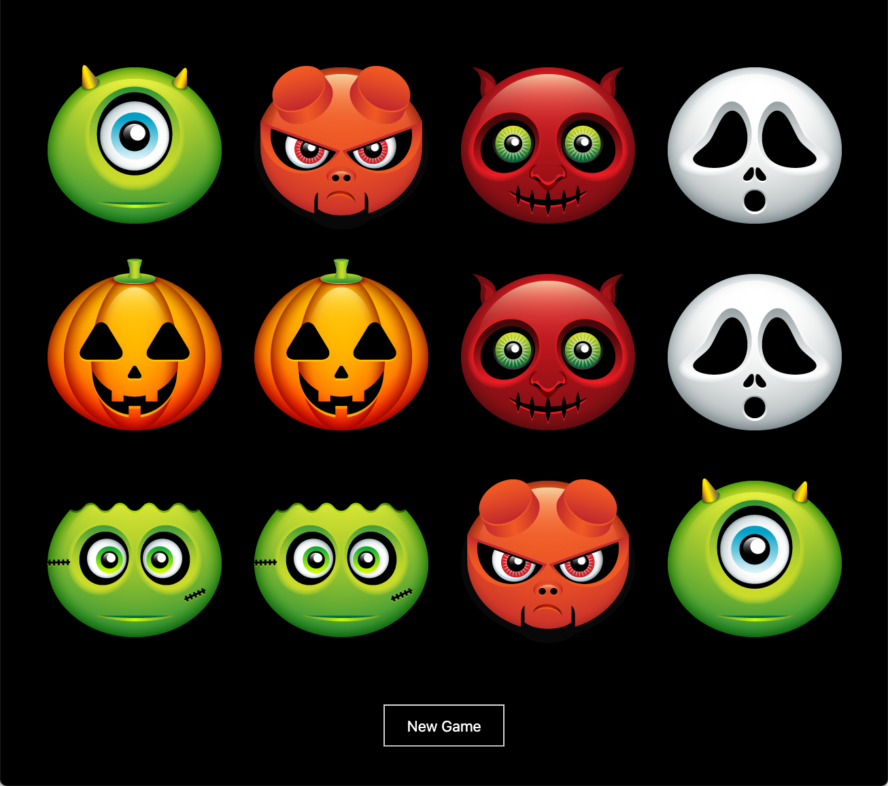

# Halloween
Fundamental exercise appending ghosts and goblins to the DOM for a fun concentration matching game.

***

***

### What You Will Learn  
Hypertext Markup Language (HTML) and Cascading Stylesheets (CSS) are the essential languages which help to display every page on the internet. These languages are definitely worthwhile to learn. JavaScript is a programming language that allows interaction with HTML and CSS via the Document Object Model (DOM). This tutorial exercises the fundamentals of HTML and CSS and how they can be combined to make a webpage look nice. 
### How This Tutorial Works  
Each of these files is a step towards the completed project. Open each file in sequence and follow the instructions provided. Those steps will be implemented in the subsequent file, so if there is any confusion about implementing an instruction, look-ahead to the next file to observe how it should be done. Since completing the steps will require saving the files, retain a copy of the originals to do this exercise again.
